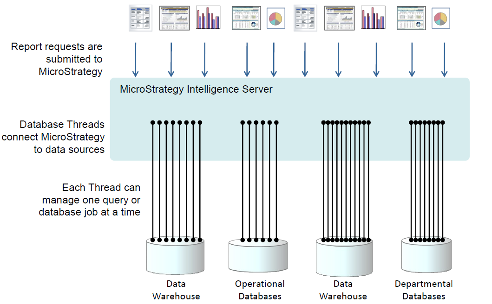
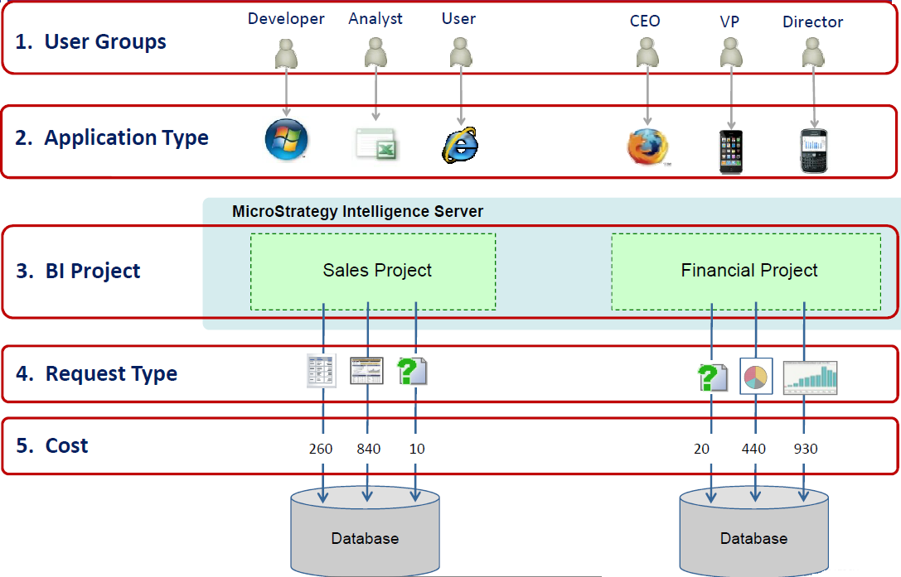
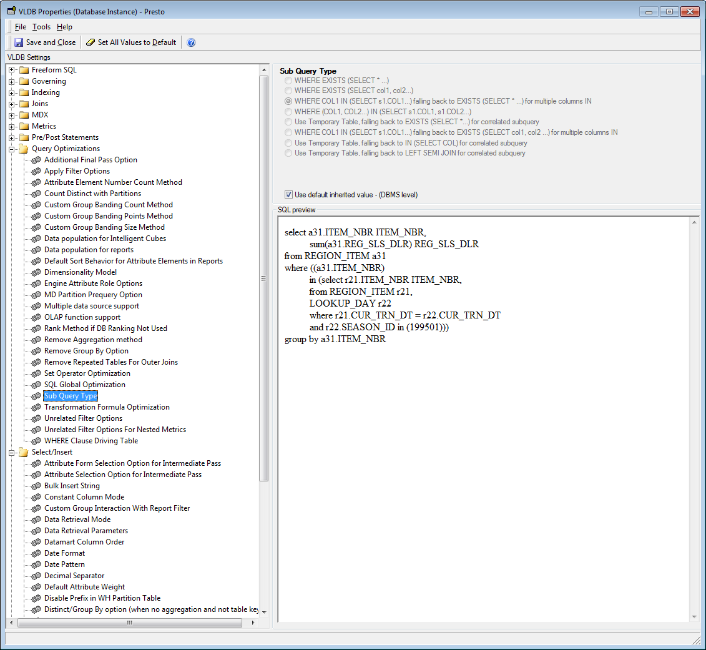

MicroStrategy, Inc.

# Integrating MicroStrategy Analytics with Azure SQL Data Warehouse

This document provides an overview of Azure SQL Data Warehouse and how MicroStrategy integrates with SQL Data Warehouse 

## Introduction
This paper provides an overview of MicroStrategy and Azure SQL Data Warehouse (SQL DW) architectures and best practices for integrating the two technologies to deliver business intelligence at scale. The range of analytical functionality of MicroStrategy is supplemented by the features and processing power provided by SQL Data Warehouse. 

### About MicroStrategy
MicroStrategy is built to enable the Intelligent Enterprise—to quickly deploy sophisticated analytical and security applications at scale. Our platform architecture is uniquely suited to deliver high performance applications and meet the business intelligence demands of every user and every organization.
The MicroStrategy platform provides VLDB drivers for all supported RDBMS platforms to generate optimized SQL that takes advantage of database specific functionality.  The full set of VLDB properties is documented in the MicroStrategy System Administration Guide.  This guide discusses settings that are most relevant to implementing MicroStrategy with SQL Data Warehouse.

### About SQL Data Warehouse  
The SQL Data Warehouse database is a shared-nothing, massively parallel processing (MPP), columnar database that decouples compute and storage to provide elastic performance at scale. SQL Data Warehouse is comprised of a control node and multiple compute nodes, each of which is built on Microsoft SQL Server technology. 

Rather than have users choose their hardware configurations, SQL Data Warehouse offers performance through scale-units known as Data Warehouse Units (DWUs). Generally, a customer can expect linear improvements in performance of scans, aggregations, and CTAS statements with increases in DWUs. Scaling out also impacts the number of readers and writers for data ingestion and export, as well as the number of concurrent queries.

SQL Data Warehouse functionality and SQL language support is targeted primarily for OLAP (Online Analytics Processing) rather than OLTP (Online Transaction Processing). Analytics means optimized for working with large amounts of data, and complex operations such as aggregation and joins against disparate data, whereas OLTP largely focuses on operations performing single row insertions and deletions, transactions, and locking, etc. 

In addition to standard SQL language support focused around functionality needed to perform analytics, that is, joining, aggregating, and sorting data, SQL Data Warehouse is extended with many SQL commands and functions to support analytic operations, and various options to provide flexible ETL (extract, transform, and load) database methods. With its primary focus on analytics and working with very large data sizes, SQL Data Warehouse also provides numerous other features such as advanced query optimization, execution plan analysis, and ability to query external data sources and formats such as Parquet from Azure Blob Storage.

For more information on SQL DW architecture please refer to [Azure SQL Data Warehouse - Massively Parallel processing (MPP) architecture](https://docs.microsoft.com/azure/sql-data-warehouse/massively-parallel-processing-mpp-architecture) in the SQL DW online documentation. 

## Query Performance

### SQL Data Warehouse DDL Considerations

The most expensive queries in MPP systems such as SQL DW are those that involve a lot of data movement. When you execute a query, SQL DW will redistribute rows across the compute nodes as necessary to fulfill the query such as on JOINs and GROUP BY statements. Users should create tables with distribution styles that minimize data movement reflective of queries that would occur in their normal workload.

#### Data Distribution

Data Distribution is an important concept in SQL Data Warehouse. It allows breaking down data processing requirements for efficient parallel processing across all hardware nodes. When creating any table in SQL DW, the distribution key is used to determine the node on which each row of data is stored.  That is, any table will be distributed across multiple nodes based upon the distribution key.  An important factor in SQL DW database design is selecting good distribution keys for fact tables.

SQL Data Warehouse supports three primary distribution styles:

1. Hash Distribution – Based on the result of a hashing algorithm on the chosen key, SQL Data Warehouse will place the row in one of sixty distributions. 
2. Round Robin – SQL Data Warehouse will distribute each incoming row in a round robin fashion
3. Replicated – SQL Data Warehouse will replicate the table on each of the compute nodes, backed by a round robin table for insert performance. 

##### Distribution Best Practices
1. Hash distribute keys on common join conditions.
Each table can only have one distribution key. As a rule of thumb, you should look at your typical query patterns and find the most common join conditions such as those between fact and the largest dimension tables as candidates for distribution. This will ensure that data is generally collocated at query time. 
2. Choose an integer type for your distribution key if possible.
Integer types such as INT or BIGINT can be used in query optimizations better than data types such as char, varchar, decimal, date, etc. 
3. Choose columns with large numbers of unique values for distribution keys.
If you choose a date column as your distribution key, you may get a relatively even distribution. However, if your query filters on a narrow date range, most of the data will land on a single compute node, thereby losing benefits of parallelization. Remember that distribution of data is more relevant to which data is chosen during a filtered query than how the data is at rest. As a rule of thumb, try to avoid any more than 30% skew across distributions.
4. Avoid a NULLABLE column for your distribution key.
Rows where the distribution key is NULL or an “unknown” value such as -1 will be distributed in a single distribution which can lead to very skewed data and bottleneck performance.
5. Replicate data for type 1 and type 2 dimensions.
If you have dimension tables that are frequently used in join conditions and are rarely updated, consider replicating these tables. This will create a copy of the table on each compute node, preventing any data movement from occurring on join. 

Consider using ROUND_ROBIN tables for tables that cannot be replicated, have no consistent join column, or have very low cardinality (uniqueness) across all columns.

MicroStrategy, like any SQL application, transparently takes advantage of distribution keys defined on base tables.  MicroStrategy recommends following SQL DW recommended best practices when implementing the physical schema of the base tables.  For more details on defining a distribution key, refer to the online SQL DW documentation *[Guidance for designing distributed tables in Azure SQL Data Warehouse](https://docs.microsoft.com/azure/sql-data-warehouse/sql-data-warehouse-tables-distribute)*.

#### Data distribution for intermediate tables 

MicroStrategy occasionally creates temporary tables to store intermediate results to support advanced calculations via multi-pass SQL. In this event data distribution across nodes is also relevant. Depending on the reporting requirements, temporary tables can only contain a small set of data or a very large set of data. The default settings assume intermediate tables to contain a small data set. 

MicroStrategy uses a round robin, heap distribution for these temporary tables. 

See the following section on "Intermediate Table Type" for default behavior and different ways to adjust DDL generated by the MicroStrategy SQL Engine for optimal performance in SQL DW.

##### Choosing the right index

1. Clustered columnstore should be your default option for most table types. Clustered columnstore is a highly efficient compressed storage format that reduces IO greatly during query time. 

2. Clustered indexes enforce a physical row sorting of your data on disk. Consider this type of index only on relatively small tables (< 60 million rows) such as (replicated) dimension tables that benefit from range filtering such as on date columns.

3. Heap tables should be used sparingly as they do not contain optimizations to help query performance. Heap tables should generally be reserved for staging tables during load as they support the fastest ingestion rate or intermediary tables during transformations which will involve a full scan of the table.

4. Add a non-clustered index (NCI) on a clustered columnstore table if you are doing singleton lookups if necessary. Keep the number of NCIs on a table to a minimum as it impacts DML performance.

### Maintaining Table Statistics

Table statistics are vital for query performance in SQL DW. Statistics are used by the query planner to generate optimal query execution plans on each of the computes nodes, as well as the distributed query plan. In SQL DW, table statistics are created and updated through the CREATE STATISTICS and UPDATE STATISTICS statements. Statistics can be managed automatically or manually. Depending on the table size and frequency of updates, users should choose which option is better suited for their workload.

In the context of a MicroStrategy deployment, it is important that all queries submitted by MicroStrategy are supported with current statistics. There are two key aspects to this. Firstly, there needs to be a strategy to maintain current statistics on all tables that implement the data model used by MicroStrategy. The second aspect involves statistics collections for intermediate tables created by MicroStrategy as part of multi-pass SQL functionality.

The MicroStrategy connector today will create statistics on behalf of the user for intermediate table creation. This ensures that each pass is supported by up to date statistics on the intermediate table that preceded it.  

## Database Workload Management 

In general, a typical MicroStrategy workload consists of a mix of queries with significantly varying complexity.  These queries originate from different MicroStrategy jobs, e.g. element requests, simple grids (select * from), complex analytical multi-pass reports, Dashboards that rely on multiple (simple or complex) queries, database write-back from Transaction Services, and Cube reports designed to fill MicroStrategy In-Memory Cubes.

Additionally, it needs to be assumed that other workloads are being simultaneously submitted to SQL DW from other sources.

Workload Management (WLM) is necessary to optimize access to database resources for concurrently executing queries. The goals of a functional workload management are to

- Optimally leverage available (hardware) resources for performance and throughput

- Prioritize access for high priority jobs

- Assure resource availability by avoiding system lock-up by any small set of jobs

Effective workload management starts with comprehensive monitoring, allowing identifying bottleneck conditions, and then leveraging the available platform tools to implement a workload management strategy that meets all of the above goals.

### Workload Management in MicroStrategy

MicroStrategy internally breaks down every user request into one or more jobs that are processed independently. Each job advances through a series of processing steps, one of which might be the submission of multi-pass queries to a database. MicroStrategy is capable of processing and submitting multiple jobs in parallel to a database. 

By default, MicroStrategy opens multiple connections called Database Threads to any data source. This is illustrated in the diagram below.



A typical BI environment encompasses queries ranging from very quick and urgent to long-running and low priority. To avoid the scenario where a small number of expensive queries can block all access to database resources it all database threads are assigned priority classes (High, Medium and Low). When report jobs are submitted, jobs are assigned a priority based on a list of different application parameters – User groups, Application type, Project, Request type and Cost. The MicroStrategy work load management routes each job according to their priority to their corresponding database threads. When no database threads are available jobs will be queued until a database thread of the appropriate class becomes available.



For more information on how to set these priorities refer to technical note <https://community.microstrategy.com/s/article/KB5401-How-to-set-Group-Prioritization-in-MicroStrategy>.

Administrators can, for each priority class and depending on the available database resources, specify the number of warehouse connections that are required for efficient job processing. 

The optimal number of connections is dependent on several factors, however the main criterion to consider when setting the number of connections is the number of concurrent queries the warehouse can support. SQL DW provides greater levels of concurrency based on its scale level. For more information about supported concurrency by scale, visit [*Memory and Concurrency Limits*](https://docs.microsoft.com/azure/sql-data-warehouse/memory-and-concurrency-limits). For more information on Job prioritization and connection mapping please refer to technical note <https://community.microstrategy.com/s/article/KB8486-What-is-Job-Prioritization-and-Connection-Management-in>.

### Workload Management in SQL DW

Workload management in SQL DW today is governed by what are known as resource classes. Resource classes dictate the amount of memory and CPU cycles a user query is granted. A user can customize user resource class roles through *sp_addrolemember* and *sp_droprolemember* statements. More information on configuring and customizing resource classes in SQL DW is provided in [*Workload management with resource classes in Azure SQL Data Warehouse*](https://docs.microsoft.com/azure/sql-data-warehouse/resource-classes-for-workload-management)*.*

SQL DW can process between 4 and 128 queries concurrently (“up to 128 queries in flight”) with the remaining queries being queued depending on the generation and DWU. For this reason, the total number of database connections from MicroStrategy to SQL DW should be chosen based on the performance level used during business hours or when MicroStrategy will be used with SQL DW. In general, a user should assign larger resource classes to high priority queries, and smaller resource classes for queries with lower priorities. Bear in mind, resource class utilization dictates total concurrency, so it is advisable to not allow every query a large resource class.

In general, there will be multiple applications submitting queries to SQL DW in addition to MicroStrategy. SQL DW query labeling allows identification of MicroStrategy queries which in turn can inform users on the performance and queue times of their queries.  

MicroStrategy by default labels all generated queries indicating the job # and project name for easy identification within SQL DW and to provide actionable references back into MicroStrategy statistics.

A MicroStrategy report job can submit one or more queries to SQL DW. In case of multi-pass reports all passes for a MicroStrategy job are typically submitted in its own (or “a single”) database session that can be traced in the SQL DW statement execution statistics. 

When managing workloads it is important to monitor the variation in the performance of repeating queries. At high concurrency, it’s pretty normal that the execution time of a particular report will depend in part on what other reports were running concurrently.  

#### Using MicroStrategy Query Labeling and Hints

SQL DW maintains and provides system information through various system views. One of the most commonly used tables to look at query history the dynamic management view (DMV) sys.dm_pdw_exec_requests, which is utilized in the procedure below to show how to track specific MicroStrategy queries using labels and hints.
```mssql
SELECT  *
FROM    sys.dm_pdw_exec_requests
WHERE   [label] LIKE '%MSTR%'
```


#### Recommendation for Prompted Reports

After identifying that prompted reports are taking long to run in MicroStrategy. These are the steps that should be carried out 

1. Identify the report using Enterprise Manager reporting and see what is the queue time in SQL DW.

2. This report could also be identified through query labeling and running queries against SQL DW system tables.

3. Decrease the resource class of short simple queries to increase concurrency and give larger more involved queries greater amounts of resources.

## Security

There are three primary levels of security when using Azure SQL Data Warehouse:

-  Resource security: Controlling access to SQL Data Warehouse through Azure
-  Connection security: Controlling which user connections are permitted to connect to SQL Data Warehouse
-  Database object security: Controlling which users have access to which database objects

### Resource and Connection Security

Azure resources such as SQL Data Warehouse are governed by role based access control (RBAC) through Azure Active Directory (AAD) and Azure Resource Manager (ARM). These roles define what privileges granted to Azure users against resources such as creation, modification, and deletion of resources within resource groups. It is also within Azure Resource Manager that security features such as Virtual Network ACL definitions and firewall rules are set up for Logical Services on which SQL Data Warehouse instances are hosted. 

Client connections in SQL DW are configured separately from Azure Resource Manager security. Users and Logins for SQL DW are configured within the Logical Server and database instance through T-SQL commands much like SQL Server today. SQL DW supports [both SQL Server Authentication (userid/password), as well as Azure Active Directory authentication](https://docs.microsoft.com/en-us/azure/sql-data-warehouse/sql-data-warehouse-authentication). Only client connections and Azure services which have been whitelisted in firewall rules and access control lists can connect to the logical server and SQL DW instance.  

MicroStrategy today supports authentication to SQL DW using SQL Server Authentication (userid/password).  

### Managing security for database objects

Access to database objects depends on the privileges granted to the user account or role. SQL DW follows the same security roles and ownership models as SQL Server. Learn more about database roles in [*Database-Level Roles*](https://docs.microsoft.com/sql/relational-databases/security/authentication-access/database-level-roles?view=azure-sqldw-latest).

## Analytic Functions: Functions for OLAP

OLAP functions are a powerful family of functions for business intelligence and data warehousing applications. These functions can provide significant analytical capabilities for many business intelligence queries.
```
<analytic function> ::= 
 <function_name> OVER ([<partition clause>] [<order by clause> [<windowing clause>]])
```
Example 1: SQL Syntax for OLAP Functions

MicroStrategy’s OLAP functions will be calculated via SQL in SQL DW rather than in the MicroStrategy analytical engine.  There is no VLDB setting associated with this option.

Refer to the supported function section to see the list of supported OLAP functions. 

### Ranking

The RANK function is closely related to other OLAP functions.  Key distinctions of the RANK function are that it requires an order by clause and does not support a window clause.  The MicroStrategy Engine is aware that SQL DW supports the Rank function, so the ranking will be done by the database rather than the MicroStrategy Analytical Engine.

```mssql 
SELECT  a11.LastName
,       SUM(a12.SalesAmountQuota) TotalSales
,       a13.SalesTerritoryRegion
,       RANK() OVER (PARTITION BY a13.SalesTerritoryRegion ORDER BY SUM(a12.SalesAmountQuota) DESC ) RankResult  
FROM dbo.DimEmployee a11  
INNER JOIN dbo.FactSalesQuota a12 ON a11.EmployeeKey = a12.EmployeeKey  
INNER JOIN dbo.DimSalesTerritory a13 ON a11.SalesTerritoryKey = a13.SalesTerritoryKey  
WHERE a11.SalesPersonFlag = 1 AND a13.SalesTerritoryRegion != N'NA'  
GROUP BY a11.LastName, a13.SalesTerritoryRegion;
```

Example 2: Rank example

## VLDB Reference

### MicroStrategy Technology Philosophy: Leverage the Power of the RDBMS

The MicroStrategy architecture has its roots in the principles of Relational OLAP (ROLAP).  A ROLAP architecture provides OLAP functionality to the end user (e.g. multidimensional framework, slice-and-dice interaction, drilling, etc.), but uses a relational database to resolve queries and perform calculations, rather than using a specialized proprietary multidimensional database.

While the virtues of ROLAP are fully extolled elsewhere, this is an important distinction for this article for two reasons.  First, MicroStrategy applications have been able to achieve industry-leading data scale because of the reliance on the processing power and data management capabilities of the underlying RDBMS.  The system design principle of partnering with the RDBMS, through features discussed in this document, is the cornerstone of achieving such scalability.  Second, this focus on integration with the RDBMS allows a business intelligence system to tap into a powerful dynamic over time: technical advances in RDBMS technology are seamlessly accessible to a MicroStrategy-based BI system.  The net benefit to the customer is a BI system that increases in value when either MicroStrategy or SQL DW add features to their products.

### Model-based Dynamic SQL Generation

Within the MicroStrategy Intelligence Server lies the MicroStrategy SQL Engine, this is responsible for generating SQL for all requests to the data warehouse.  Hence, to the RDBMS, a MicroStrategy application is an SQL-based application, in many ways like any other SQL application accessing SQL DW.

#### Schema Abstraction

The SQL Engine performs its work based on a metadata model defined to the system.  Note that the MicroStrategy metadata is not used to store joins or schema-type information, such as star or snowflake. Instead, the metadata model stores content information for each table indicating that it contains a set of particular facts and a set of particular attributes. When a report request is submitted, the Engine breaks the report down into the individual components (i.e. attributes and facts), then begins searching the model to determine which combination of tables will be necessary and efficient in resolving the request.

Schema abstraction of the database columns (into MicroStrategy attributes and facts) provides the flexibility necessary to allow applications to be created quickly without having to change the structure of the data model.  MicroStrategy is able to support virtually any type of star, snowflake, or hybrid physical design, including transactional schemas.  The business model defined in MicroStrategy is easily able to span multiple stars/snowflakes in a single application and even a single query.  MicroStrategy supports dimensional models well, but does not require a dimensional model.

#### Multi-pass SQL

One of the key elements to providing analytical sophistication in business intelligence applications is MicroStrategy’s ability to generate *multi-pass SQL*.  Multi-pass SQL is required to answer analytical questions that cannot be answered with a single SQL query block.  Examples of questions / scenarios that require multi-pass SQL include:

- Set qualification: “Show me sales by region over the last six months, but only for customers who      purchased one of the 5 most popular products.”
- Split metrics: query returns sales data from a sales star schema and inventory data from an inventory      star schema
- Metrics calculated at different levels of aggregation
- Metrics calculated with different filtering criteria
- Simulating outer joins on RDBMS platforms that do not support them natively
- Querying multiple tables due to application-level partitioning

 Support for these scenarios, especially when combined together, provide a framework for significant analytic questions and value to the users of the system.  One of the main optimizations the MicroStrategy SQL Engine makes is to generate SQL that performs these multi-pass queries as efficiently as possible.

#### Optimizing SQL Generation

The rest of this paper describes how the general function of the MicroStrategy architecture described above can be modified to work especially well with SQL DW.

## VLDB Optimizations for SQL DW

### Overview

The MicroStrategy platform provides VLDB drivers for all supported RDBMS platforms to generate optimized SQL that takes advantage of database specific functionality.  The full set of VLDB properties is documented in the MicroStrategy System Administration Guide.  Settings that are most relevant to SQL DW are discussed below.

### Default and Recommended VLDB Settings

MicroStrategy VLDB properties are settings that customize the SQL and MDX generated by MicroStrategy Intelligence Server. The settings provide a way to manipulate SQL join patterns, SQL insert statements, and table creation properties without manually altering SQL Scripts as well as how the Analytical Engine manages certain results. By adjusting the SQL and MDX statements using VLDB properties, specific optimizations can further enhance the performance of queries, and also provide the capability to easily incorporate and take advantage of new RDBMS features introduced in new versions. This is a key strength of MicroStrategy.

MicroStrategy’s VLDB driver for Azure SQL Data Warehouse is designed to use SQL DW-specific features when they lead to improved performance or analytical functionality.  When a Database Instance is configured to use the “Azure SQL Data Warehouse” database connection type, the recommended values for all VLDB properties will automatically be used for every report executed against that Database Instance.  The recommended VLDB optimizations for Azure SQL Data Warehouse are listed below. Administrators may add or modify VLDB optimizations to MicroStrategy projects, reports, or metrics at any time so that their queries are specifically optimized for their data warehouse environment.

### Selected VLDB Settings for Azure SQL Data Warehouse  

| **VLDB Category**     | **VLDB Property Setting**   | **Value**                                                  |
| --------------------- | --------------------------- | ---------------------------------------------------------- |
| Tables                | Intermediate Table   Type   | Derived Table                                              |
| Tables                | Fallback Table   Type       | Permanent Tables                                           |
| Tables                | Table Space                 | WITH (DISTRIBUTION =   ROUND_ROBIN,HEAP)                   |
| Tables                | Table Creation   Type       | Implicit                                                   |
| Tables                | Max passes to Fallback      | 20                                                         |
| Indexing              | Primary Index   Control     | Create primary   index/partition key                       |
| Query Optimizations   | Sub Query Type              | Where   EXISTS(select (col1, col2…))                       |
| Query Optimizations   | Poststring for   Main SQL   | OPTION (LABEL = 'MSTR Report:!o, MSTR   Project:!p')       |
| Joins                 | Full Outer Join   Support   | Supported                                                  |
| Query   Optimizations | SQL Global   Optimization   | Level 4: Level 2 +   Merge All Passes with Different Where |
| Query   Optimizations | Set Operator   Optimization | Enable set   operator optimization                         |
| Select/Insert         | UNION multiple INSERT       | Do not use UNION                                           |

#### Intermediate Table Type

The ability to generate multi-pass SQL is a key feature of the MicroStrategy SQL Engine. SQL DW supports several different ways to implement multi-pass SQL.

##### Derived Tables

Rather than implement each pass in a separate table, Derived Table syntax allows the SQL Engine to issue additional passes as query blocks in the FROM clause.  Instead of issuing multiple SQL statements that create intermediate tables, the SQL engine generates a single large SQL statement. This can allow queries to run faster since there is no CREATE TABLE or DROP TABLE statements to catalog, no corresponding locks on the system tables, and no logging of records inserted into a physical table.

In theory, derived table syntax should result in query performance at least as good as when using temporary tables.

Derived Tables is the default way for SQL DW to manage intermediate results by the SQL Engine.


```mssql
Select      a12.year_id  year_id,
      max(a14.year_desc)  year_desc,
      sum(a11.cost_amt)  WJXBFS1
From  cost_market_div   a11
      join  lookup_day  a12
        on  (a11.cur_trn_dt = a12.cur_trn_dt)
      join  (select     a12.year_id  year_id
      From  region_division   a11
            join  lookup_day  a12
              on  (a11.cur_trn_dt = a12.cur_trn_dt)
      where a12.year_id = 1993
      group by    a12.year_id
      having      sum(a11.tot_sls_dlr) > 0.0
      )     pa13
        on  (a12.year_id = pa13.year_id)
      join  lookup_year a14
        on  (a12.year_id = a14.year_id)
Where       a12.year_id = 1993
group by    a12.year_id
```


Note that not all reports are able to use derived tables.  There are two primary scenarios in which temporary tables must be used instead of derived tables:

- When a report uses a function supported in the MicroStrategy analytical engine that is not supported in      SQL DW (e.g. many of the functions in the financial and statistical function packages).  If these      functions are used in intermediate calculations, the MicroStrategy analytical engine will perform calculations and then insert records back into the RDBMS for further processing. Inserting records back into SQL DW requires a temporary table.
- When a report uses the MicroStrategy partitioning feature. When using partitioning, the SQL Engine executes a portion of the query in order to determine which partitions to use. The results are then used to construct the rest of the query.  Because the full structure of the query is not known prior to execution, the SQL engine must use temporary tables to execute the query in multiple steps.

These situations do not cover 100% of the cases in which temporary tables must be used.  The rest of the cases are relatively obscure combinations of VLDB settings, such as certain combinations of Sub Query Type plus outer join settings on metrics plus non-aggregatable metrics.

When using derived tables, the UNION Multiple INSERT setting can be set to “Use Union.” This allows the engine to use UNION statements within derived tables instead of multiple INSERT INTO statements. This setting is relevant for reports that use partitioning and consolidations.

##### True Temporary Table

Another way to implement multi-pass SQL is to store the results of each pass (i.e. each query block) in a separate table and use it as input for the subsequent pass.  When the VLDB property Intermediate Table Type is set to “True Temporary Table”, the results of each pass are stored in a temporary table.  

The use of a temporary table is specified by generating a table name containing a "#" prefix (instead of using the "TEMPORARY" key word.

Temporary tables could incur less overhead than permanent tables.


```mssql
create table #TEMP1 as 
select a21.STORE_NBR STORE_NBR, 
(sum(a21.REG_SLS_DLR) + sum(a21.PML_SLS_DLR)) TOT_SLS, 
sum(a21.PML_SLS_DLR) PROMO_SLS 
from STORE_DIVISION a21 
where a21.STORE_NBR = 1 
group by a21.STORE_NBR 
```


#### Dynamically Selecting A Different Intermediate Table Type

In theory, multi-pass SQL using derived tables should result in the best execution plans from SQL DW.  This is because the RDBMS optimizer has a “full view” of the entire report.  In practice, however, some reports that have many, many derived tables seem to be “too complex” and not perform as well when using derived tables. MicroStrategy will fall back to using temporary tables in case the analytical complexity of a report requires more than 20 passes.

As mentioned above, the default Intermediate Table Type for SQL DW is to use derived tables.  In cases when where some reports may be running with suboptimal plans because they are using derived tables, they can be manually changed to use ‘permanent’ or ‘true temporary tables’ to analyze the performance. In the case of SQL DW it is true temporary tables. A temporary table typically incurs less I/O and better performance than permanent tables and is recommended.

By the above, in essence, it means that if the Intermediate Table Type is set to “Derived tables,” then true temporary tables should be specified as the “fallback” table type, should the specific report requirements not support the use of derived table expressions.  For each report, the SQL Engine will follow an “all or nothing” policy in determining whether to use derived table syntax.  If the entire report cannot be resolved in a single statement with derived tables, the SQL Engine will automatically revert to the Fallback Table Type syntax and not use derived table syntax at all for the report.

#### Drop Temp Table Method

When true temporary tables are used as FallBack Table types, the tables are dropped automatically when the SQL DW session is ended.  In the case where a single session runs multiple reports, then you still have to drop the temporary tables associated with one report before moving on to the next. We would see ‘drop table …’ SQL commands generated explicitly by MicroStrategy.

#### Table Creation Type

When creating tables in SQL DW, the SQL Engine will use implicit table creation rather than “explicit” table creation. Implicit definitions have many advantages. When using implicit table creation, the tables created by MicroStrategy (true temporary tables) will automatically have statistics created. Implicit definitions will use round robin distribution with heap to the newly created temporary table; this is a performance advantage.  Finally, the intermediate table created in such a manner, is automatically dropped at the end of the session in which it was created.

In SQL DW, when you switch from Explicit to Implicit the syntax will be as below. 

#### Explicit table syntax
```mssql
create table #ZZTZPXBGZY6PO000 (
      year_id     INT, 
      WJXBFS1     FLOAT, 
      WJXBFS2 REAL      )
 WITH (DISTRIBUTION = ROUND ROBIN,HEAP)
insert into #ZZTZPXBGZY6PO000 
Select      distinct a12.year_id  year_id,
      a11.item_nbr  WJXBFS1,
      a11.class_nbr  WJXBFS2
From  store_item_93     a11
      Join  lookup_day  a12
        on  (a11.cur_trn_dt = a12.cur_trn_dt)
```


#### Implicit table syntax

 ```mssql
create table #ZZTNW2U6VGQPO000 as
Select      distinct a12.year_id  year_id,
      a11.item_nbr  WJXBFS1,
      a11.class_nbr  WJXBFS2
From  store_item_93     a11
      Join  lookup_day  a12
        on  (a11.cur_trn_dt = a12.cur_trn_dt)

```

#### Sub Query Type

There are many cases in which the SQL Engine will generate sub-queries (i.e. query blocks in the WHERE clause):

- Reports that use Relationship Filters
- Reports that use “NOT IN” set qualification, e.g. AND NOT <metric_qualification> or AND NOT <relationship_filter>
- Reports that use Attribute qualification with M-M relationships, e.g. show Revenue by Category, filter on Catalog
- Reports that “raise the level” of a filter, e.g. dimensional metric at Region level, but qualify on Store
- Reports that use non-aggregatable metrics, e.g. inventory metrics
- Reports that use Dimensional extensions
- Reports that use Attribute to attribute comparison in the filter

 The default setting for Sub Query Type for SQL DW is Option 2 – “Where EXISTS (select (col1, col2…)).” 

 ```mssql
create table #ZZTK9G3WSVTPO000 (
       year_id        int, 
       WJXBFS1       DOUBLE PRECISION)
 WITH (DISTRIBUTION = ROUND ROBIN,HEAP)

insert into #ZZTK9G3WSVTPO000 
Select a12.year_id  year_id,
       sum(a11.tot_sls_dlr)  WJXBFS1
From   store_item_94       a11
       join   lookup_day   a12
         on   (a11.cur_trn_dt = a12.cur_trn_dt)
where  ((exists (select    r11.store_nbr
       From   store_item_93       r11
       Where  r11.class_nbr = 1
        And   r11.store_nbr = a11.store_nbr))
and a12.year_id>1993)
group by     a12.year_id
```

Some reports may perform better with Option 6 – “Use temporary table, falling back to IN for correlated subquery”.  Reports that include a filter with an “AND NOT set qualification” (e.g. AND NOT relationship filter) will likely benefit from using temp tables to resolve the subquery.  However, such reports will probably benefit more from using the Set Operator Optimization discussed below.



The other settings are not likely to be advantageous with  SQL DW

#### SQL Global Optimization 

This setting can substantially reduce the number of SQL passes generated by MicroStrategy.  In MicroStrategy 9, SQL Global Optimization reduces the total number of SQL passes with the following optimizations:

- Eliminates unused SQL passes, e.g. a temp table is created but not referenced in a later pass
- Reuses redundant SQL passes
  - E.g. exact same temp table is created multiple times à single temp table is created
  - Combines SQL passes where the SELECT list is different

o   E.g. two temp tables have same FROM clause, same JOINs, same WHERE clause, same GROUP BY à SELECT lists are combined into single SELECT statement

- Combines SQL passes where the WHERE clause is different
  - E.g. two temp tables have same SELECT list, same FROM clause, same JOINs, same GROUP BY à predicates from the WHERE clause are moved into CASE statements in the SELECT list.

See the System Administration Guide for a complete description of the cases covered by this setting. The default setting for SQL DW is to enable SQL Global Optimization at its highest level.

#### Set Operator Optimization

This setting is used to combine multiple subqueries into a single subquery using set operators (i.e. UNION, INTERSECT, EXCEPT).  The default setting for SQL DW is to enable Set Operator Optimization.  

 ```mssql
select 	a11.CUSTOMER_ID CUSTOMER_ID, 
	   	a11.TOT_DOLLAR_SALES WJXBFS1 
from 	CUSTOMER_SLS a11 
join 	LU_CUSTOMER a12 
on 		(a11.CUSTOMER_ID = a12.CUSTOMER_ID) 
where 	(a11.CUSTOMER_ID) 
               in (((select r12.CUSTOMER_ID 
               from ORDER_DETAIL r11 
               join LU_ORDER r12 
               on (r11.ORDER_ID = r12.ORDER_ID) 
               where r11.ITEM_ID in (2)) 
intersect (select r12.CUSTOMER_ID 
from 	ORDER_DETAIL r11 
join 	LU_ORDER r12 
on 		(r11.ORDER_ID = r12.ORDER_ID) 
where 	r11.ITEM_ID in (3))))
 ```

## Data Type Mapping

### Supported data types:

| **SQL DW data type** | **MicroStrategy data type** |
| -------------------- | --------------------------- |
| bigint               | DssDataTypeInteger   (8)    |
| binary               | DssDataTypeBinary           |
| bit                  | DssDataTypeVarChar          |
| char                 | DssDataTypeChar             |
| date                 | DssDataTypeDate             |
| datetime             | DssDataTypeTimeStamp        |
| datetime2            | DssDataTypeTimeStamp        |
| datetimeoffset       |                             |
| decimal              | DssDataTypeNumeric          |
| float                | DssDataTypeFloat            |
| int                  | DssDataTypeInteger   (4)    |
| money                |                             |
| money                | DssDataTypeNumeric          |
| nchar                |                             |
| numeric              | DssDataTypeNumeric          |
| nvarchar             |                             |
| real                 | DssDataTypeReal             |
| smalldatetime        | DssDataTypeTimeStamp        |
| smallint             | DssDataTypeInteger(2)       |
| smallmoney           | DssDataTypeNumeric          |
| text                 | DssDataTypeLongVarChar      |
| time                 | DssDataTypeTime             |
| tinyint              | DssDataTypeInteger   (1)    |
| uniqueidentifier     |                             |
| varbinary            | DssDataTypeVarBin           |
| varchar              | DssDataTypeVarChar          |

### Unsupported datatypes:

| **SQL DW Datatype** | **Workaround**                         |
| ------------------- | -------------------------------------- |
| datetimeoffset      | datetime2                              |
| geometry/geography  | varbinary                              |
| hierarchyid         | nvarchar(4000)                         |
| image               | varbinary                              |
| nchar/nvarchar      | char/varchar                           |
| sql_variant         | Denormalize   into columns             |
| user-defined   type | convert   to native type when possible |
| xml                 | Varchar or   text                      |

## Support of MicroStrategy Function Library

The MicroStrategy platform includes libraries of mathematical, statistical, and financial functions that can be applied to any report or customized application. More than 250 analytical functions are available out-of-the-box, and additional libraries can be added by plugging in custom functions or proprietary algorithms.

| **Category Desc** | **Connector**           | **Azure SQL Data Warehouse**                                 |
| ----------------- | ----------------------- | ------------------------------------------------------------ |
|                   | Function Name           | Function SQL Pattern                                         |
| **Basic**         | StdevFunction           | STDEV(#0#< #*#>)                                             |
|                   | StdevPFunction          | STDEVP(#0#< #*#>)                                            |
|                   | VarFunction             | VAR(#0#< #*#>)                                               |
|                   | VarPFunction            | VARP(#0#< #*#>)                                              |
| **Date & Time**   | AddDaysFunction         | DATEADD(DD, #1, #0)                                          |
|                   | AddMonthsFunction       | DATEADD(MM, #1, #0)                                          |
|                   | CurrentDateFunction     | CONVERT (date, GETDATE())                                    |
|                   | CurrentDateTimeFunction | GETDATE()                                                    |
|                   | CurrentTimeFunction     | SYSDATETIME()                                                |
|                   | DateFunction            | CAST(#0 AS DATE)                                             |
|                   | DayOfMonthFunction      | DATEPART(DAY, #0)                                            |
|                   | DayOfWeekFunction       | DATEPART(WEEKDAY, #0)                                        |
|                   | DayOfYearFunction       | DATEPART(DAYOFYEAR, #0)                                      |
|                   | DaysBetweenFunction     | DATEDIFF(DD, #0, #1)                                         |
|                   | MonthEndDateFunction    | CONVERT(DATE, DATEADD(mm, 1 + DATEDIFF(mm, 0, #0), -1))      |
|                   | MonthFunction           | DATEPART(MONTH, #0)                                          |
|                   | MonthStartDateFunction  | CONVERT(DATE, DATEADD(mm, DATEDIFF(mm, 0, #0), 0))           |
|                   | QuarterFunction         | DATEPART(QUARTER, #0)                                        |
|                   | WeekFunction            | DATEPART(WEEK, #0)                                           |
|                   | YearEndDateFunction     | CONVERT(DATE, DATEADD(yy, 1 + DATEDIFF(yy, 0, #0), -1))      |
|                   | YearFunction            | DATEPART(YEAR, #0)                                           |
|                   | YearStartDateFunction   | CONVERT(DATE, DATEADD(yy, DATEDIFF(yy, 0, #0), 0))           |
| **Internal**      | BandingCFunction        | Case when (#1=#2 and #0=#1) then #3 when (#0=#2) then #3 when (#0   between #1 and #2) then floor(1.0*#3*(#0- #1)/(#2- #1)+1) else 0 end |
|                   | BandingFunction         | Case when (#0=#2 and #2=#1+#3*floor((#2- #1)/#3) ) then   floor(1.0*(#0- #1)/#3) when (#0 between #1 and #2) then floor(1.0*(#0-   #1)/#3) +1 else 0 end |
| **Mathematical**  | AbsFunction             | ABS(#0)                                                      |
|                   | AcosFunction            | ACOS(#0)                                                     |
|                   | AcoshFunction           | LOG(#0+SQRT(#0-1)*SQRT(#0+1))                                |
|                   | AsinFunction            | ASIN(#0)                                                     |
|                   | AsinhFunction           | LOG(#0+SQRT(POWER(CAST(#0 AS FLOAT),2)+1))                   |
|                   | Atan2Function           | ATN2(#1, #0)                                                 |
|                   | AtanFunction            | ATAN(#0)                                                     |
|                   | AtanhFunction           | ((LOG(1+#0)-LOG(1- #0))/2)                                   |
|                   | CeilingFunction         | CEILING(#0)                                                  |
|                   | CosFunction             | COS(#0)                                                      |
|                   | DegreesFunction         | (#0*180/(ASIN(1)*2))                                         |
|                   | ExpFunction             | EXP(#0)                                                      |
|                   | FloorFunction           | FLOOR(#0)                                                    |
|                   | Int2Function            | FLOOR(#0)                                                    |
|                   | IntFunction             | FLOOR(#0)                                                    |
|                   | LnFunction              | LOG(#0)                                                      |
|                   | Log10Function           | LOG10(#0)                                                    |
|                   | LogFunction             | LOG(#0)/LOG(#1)                                              |
|                   | ModFunction             | (#0-FLOOR((#0)/NULLIF(#1, 0))*(#1))                          |
|                   | PowerFunction           | POWER(#0, #1)                                                |
|                   | QuotientFunction        | CAST((#0)/NULLIF(#1, 0) AS INTEGER)                          |
|                   | RadiansFunction         | (#0*ASIN(1)*2/180)                                           |
|                   | RandbetweenFunction     | ((#1- #0)*RAND()+#0)                                         |
|                   | RankFunction            | #0#,#<partition by#>#<#, #*#>#\|rank () over   (#1#2#<,#*#> order by #0) |
|                   | Round2Function          | ROUND(#0, #1)                                                |
|                   | RoundFunction           | ROUND(#0, 0)                                                 |
|                   | SinFunction             | SIN(#0)                                                      |
|                   | SqrtFunction            | SQRT(#0)                                                     |
|                   | TanFunction             | TAN(#0)                                                      |
|                   | TruncFunction           | CAST(#0 AS INTEGER)                                          |
| **Null & Zero**   | NullToZeroFunction      | ISNULL(#0, 0)                                                |
|                   | ZeroToNullFunction      | (CASE WHEN #0=0 THEN NULL ELSE #0 END)                       |
| **OLAP**          | FirstInRangeFunction    | first_value(#0) over(#1)                                     |
|                   | LagFunction             | lag(#0#<, #*#>) over ([#P] [#O])                             |
|                   | LeadFunction            | lead(#0#<, #*#>) over ([#P] [#O])                            |
|                   | MovingAvgFunction       | avg(#0) over(#1)                                             |
|                   | MovingCountFunction     | count(#0) over(#1)                                           |
|                   | MovingMaxFunction       | max(#0) over(#1)                                             |
|                   | MovingMinFunction       | min(#0) over(#1)                                             |
|                   | MovingStdevFunction     | stdev(#0) over(#1)                                           |
|                   | MovingStdevPFunction    | stdevp(#0) over(#1)                                          |
|                   | MovingSumFunction       | sum(#0) over(#1)                                             |
|                   | OLAPAvgFunction         | avg(#0#< #*#>) over ([#P] [#O] [#W])                         |
|                   | OLAPCountFunction       | count(#0#< #*#>) over ([#P] [#O] [#W])                       |
|                   | OLAPMaxFunction         | max(#0#< #*#>) over ([#P] [#O] [#W])                         |
|                   | OLAPMinFunction         | min(#0#< #*#>) over ([#P] [#O] [#W])                         |
|                   | OLAPSumFunction         | sum(#0#< #*#>) over ([#P] [#O] [#W])                         |
|                   | RunningAvgFunction      | avg(#0) over(#1)                                             |
|                   | RunningCountFunction    | count(#0) over(#1)                                           |
|                   | RunningMaxFunction      | max(#0) over(#1)                                             |
|                   | RunningMinFunction      | min(#0) over(#1)                                             |
|                   | RunningStdevFunction    | stdev(#0) over(#1)                                           |
|                   | RunningStdevPFunction   | stdevp(#0) over(#1)                                          |
|                   | RunningSumFunction      | sum(#0) over(#1)                                             |
| **Statistical**   | InverseFisherFunction   | ((EXP(2*#0)-1)/(EXP(2*#0)+1))                                |
|                   | StandardizeFunction     | case when (#2 > 0) then (#0 - #1)/(#2) else NULL end         |
| **String**        | ConcatBlankFunction     | (#0#< + ' ' + #*#>)                                          |
|                   | ConcatFunction          | CONCAT(#0#<, #*#>)                                           |
|                   | InitCapFunction         | (UPPER(SUBSTRING(#0, 1, 1)) + LOWER(SUBSTRING(#0, 2, Len(#0) - 1))) |
|                   | LeftStrFunction         | LEFT(#0, #1)                                                 |
|                   | LengthFunction          | LEN(#0)                                                      |
|                   | LowerFunction           | LOWER(#0)                                                    |
|                   | LTrimFunction           | LTRIM(#0)                                                    |
|                   | PositionFunction        | CHARINDEX(#0, #1)                                            |
|                   | RightStrFunction        | RIGHT(#0, #1)                                                |
|                   | RTrimFunction           | RTRIM(#0)                                                    |
|                   | SubStrFunction          | SUBSTRING(#0, #1, #2)                                        |
|                   | TrimFunction            | LTRIM(RTRIM(#0))                                             |
|                   | UpperFunction           | UPPER(#0)                                                    |

